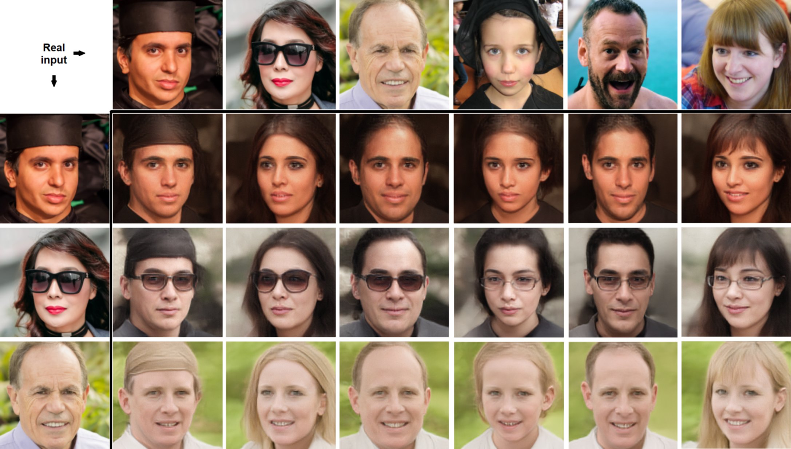

# Deep Automodulators


<br/>

<br/>

Code for the paper:
* Heljakka, A., Hou, Y., Kannala, J., and Solin, A. (submitted). **Deep Automodulators**. [[arXiv preprint]](https://arxiv.org/abs/1912.10321). NeurIPS 2020, to appear.

Implementation by **Ari Heljakka** (drawing from [2-4], h5tool from [5]).

## Pre-requisites

Tested with:
* Ubuntu 16.04
* Python v3.7
* CUDA v10.2
* PyTorch v1.2.0

## Quick start

1. Download the FFHQ pre-trained models.
2. Try the Evaluation Jupyter Notebook at `/src/pioneer/Automodulator%20Evaluator.ipynb`

## Pre-trained models

[Pre-trained models](https://drive.google.com/drive/folders/1SJuIINgq8j2Rr-DTi_WKg-FRvoVLrt5_) are available for each dataset.
You can run them on command line with the [usage](#usage) examples below, inserting the proper dataset name (e.g. `-d celebaHQ`), checkpoint path name (e.g. `--save_dir cahq1`) and checkpoint ID, or use `-1` for the latest (e.g. `--start_iteration=36200000`).


## Datasets

If you only use the pre-trained models, you do not need any datasets except for reproducing the exact reconstruction results shown on the paper.

Supported datasets are:
- FFHQ
    - Download via [NVIDIA repository](https://github.com/NVlabs/ffhq-dataset) and split identities 1-60k for training and 60001 - 70k for testing.
- CelebA-HQ
    - You need to put the dataset in H5 format for PyTorch, separately for training and testing, as follows:
        1) Download the CelebA dataset (originals, NOT the aligned & cropped one)
        2) Download the Delta files from the author https://github.com/tkarras/progressive_growing_of_gans (see "Data files needed to reconstruct the CelebA-HQ dataset")
        3) Run the dataset-tools/h5tool.py we provide (which contains the train/test split unlike the original CelebA-HQ script). For the syntax, run
            ```
            python h5tool.py -h
            ```
        Please run first `data_split=train`, then `data_split=test`. This will create a separate 27k/3k split for training and testing.
- LSUN Bedrooms
    - Used as normal. Please bear in mind the very long time on first run of any LSUN usage to just build the index (often many hours).
- LSUN Cars

Regular CelebA will likely also work but it has no scheduler setup (see [Training](#training)) but you can try to replicate the CelebA-HQ scheduler. For CelebA, please choose the aligned & cropped version; also, you still need to do the train/test split into separate directories manually.

## Dependencies
```
pip install -r requirements.txt
```
For logging (when training), either run the following or specify `--no_TB`:
```
pip install tensorboardx
```

## Evaluation

For all command-line arguments, run
```
python train.py -h
```

You can evaluate a trained model by giving its directory as `save_dir`. The checkpoints are saved under `[save_dir]/checkpoint`.
All examples show a sample checkpoint step count in the `--start_iteration` argument.

Use `--testonly` to designate the testing (evaluation) mode, as opposed to training.

Note that each checkpoint has 2 files: the N_state and the N_SNU. Both are needed.

1. Reconstructions, random samples and interpolations (FFHQ, 256x256 or 512x512):
```
python -m pioneer.train -d ffhq --save_dir FFHQ_quicktest --train_path /data/FFHQ_train --test_path /data/FFHQ_test --sample_N=16 --reconstructions_N=8 --interpolate_N=3 --start_iteration=-1 --testonly
```

2. Reconstructions of your own input images (FFHQ, 256x256 or 512x512 - use the 512x512 model file unless your input resolution is lower):
(Please remember to put your images under an extra subdirectory (e.g. `/my_images/png/` for the below example. Face images must be cropped and aligned as in CelebA-HQ and FFHQ, respectively.)
```
python -m pioneer.train -d ffhq --save_dir FFHQ_quicktest --sample_N=16 --reconstructions_N=8 --interpolate_N=3 --start_iteration=-1 --testonly --aux_inpath /my_images
```

For style-mixing examples, please see the Evaluator Jupyter Notebook.
For not applying the layer noise, add `--no_LN`. (Also possible for models originally trained with layer noise.)
For training or evaluating the CelebaHQ model, add `--small_darch` to indicate the smaller decoder architecture.


## Training

All training uses the pre-configured scheduler. For new datasets, you can configure the schedule of phases, margin values and learning rates in `makeTS(...)` method of `train.py`. See the existing code for how to set them up.
Pre-configured schedule exists for CelebA-HQ, FFHQ, LSUN Bedrooms and LSUN Cars.

The batch sizes have been selected to enable running on 12 GB of GPU memory. 1-GPU setup has been confirmed to work in all cases up to 9.6M steps, and 2-GPU setup on all other resolutions. Please ensure enough disk space for checkpoints.

To resume training from a checkpoint, it is sufficient to add `--start_iteration=N` where N is the step number of your latest state file (eg. for `checkpoint/256000_state`, N=256000). Use `start_iteration=-1` to take the latest state. For each checkpoint, the `N_SNU` file contains the U matrices of the spectral normalization layers. If the file is not there, the U matrix is restored, but this is not guaranteed to always work.

The resolutions of each phase are defined in powers of 2, as follows:
0 = 4x4,
...,
3 = 32x32,
4 = 64x64,
5 = 128x128,
6 = 256x256,
7 = 512x512

Note that all loss function hyper-parameters in the code base are scaled by a factor of 0.1 in comparison to the paper.

Example of regular training FFHQ, up to 512x512:
```
python -m pioneer.train -d ffhq --save_dir FFHQ_quicktest --train_path /data/FFHQ_train --test_path /data/FFHQ_test --sample_N=16 --reconstructions_N=8 --interpolate_N=0 --total_kimg=45000
```

To enforce the flop-invariance on a specific layer (e.g. 2), add `--flip_invariance_layer=2`. This will both add an extra support layer in the decoder (as in the experiment in the paper) and also start using the training method which will horizontally flop 50% of the minibatch.

If the intermediate results are complete noise after ~10 Million training images for one of the supported datasets, then it is recommended to restart with changing the random seed with `--manual_seed=N` parameter. If you are working with a dataset of your own, then it is best to check whether the samples in lower-resolution stages looked correct (before breaking), and then either make the training stages in the last "stable" resolution longer, or make the KL margin tighter. You can adjust these in the make_ts() function.

## Main Results

| Dataset, resolution    |     FID-50k     |       PPL      |
| ---------------------- | --------------- | -------------- |
| FFHQ, 256x256          |     31.64       |      250.2     |
| CelebaHQ, 256x256      |     29.13       |      203.8     |
| LSUN Bedrooms, 256x256 |     25.53       |       -        |
| LSUN Cars, 256x256     |     19.82       |       -        |

You can reproduce the samples for the table as follows.

FFHQ, 256x256:
```
python -m pioneer.train -d ffhq --save_dir ffhq256 --sample_N=50100  --start_iteration=-1 --testonly
```
CelebaHQ, 256x256:
```
python -m pioneer.train -d celebaHQ --save_dir celebaHQ256 --small_darch --sample_N=50100  --start_iteration=-1 --testonly
```
LSUN Bedrooms, 256x256:
```
python -m pioneer.train -d lsun --save_dir lsunBedrooms256 --sample_N=50100  --start_iteration=-1 --testonly
```
LSUN Cars, 256x256:
```
python -m pioneer.train -d lsun --save_dir lsunCars256 --sample_N=50100  --start_iteration=-1 --testonly
```

## Support

For all correspondence, please contact ari.heljakka@aalto.fi.

Support and email replies are not always guaranteed, but we will appreciate and evaluate all feedback.

## References

[1] Heljakka, A., Hou, Y., Kannala, J., and Solin, A. (submitted). **Deep Automodulators**. [[arXiv preprint]](https://arxiv.org/abs/1912.10321)

[2] https://github.com/AaltoVision/balanced-pioneer

[3] https://github.com/rosinality/progressive-gan-pytorch

[4] https://github.com/DmitryUlyanov/AGE

[5] Karras, T., Aila, T., Laine, S., and Lehtinen, J. (2018). **Progressive growing of GANs for improved quality, stability, and variation**. In: *International Conference on Learning Representations (ICLR)*. https://github.com/tkarras/progressive_growing_of_gans

## License

This software is distributed under the MIT License; please refer to the file LICENSE, included with the software, for details.
